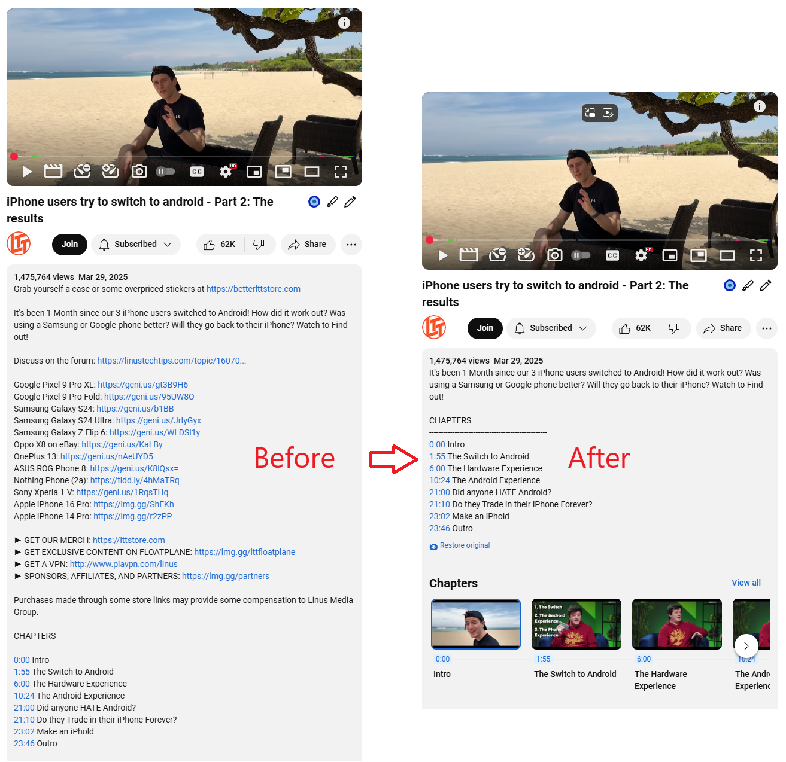

# YouTube Description Cleaner Extension
A browser extension that removes sponsorships and unrelated links from YouTube video descriptions with multiple AI backend support.

### Screenshots

#### Extension in Action

#### Before and After Comparison

## Features

- Removes sponsor segments and promotional links
- Multiple processing modes:
  - Simple (first paragraph only)
  - Google Gemini (AI)
  - OpenAI ChatGPT (AI)
  - Ollama (local AI models)
- Auto-clean on page load
- One-click original description restore
- Debug mode for developers

## Installation

### From Chrome Web Store

The extension is currently pending review and will hopefully be available soon.

### From sources

1. Download the extension files.
2. In a Chromium-based browser:
  - Go to `chrome://extensions/`.
  - Enable "Developer mode".
  - Click "Load unpacked".
  - Select the extension folder.

## Configuration

Configure these options in the popup:

- **Processing Mode**: Select text processing method
- **API Key**: Required for cloud AI services
- **Ollama Settings**: URL and model for local Ollama
- **Debug Mode**: Enable for troubleshooting
- **Auto Clean**: Process descriptions automatically

## Supported Backends

| Mode       | Requires API Key | Description                          |
|------------|------------------|--------------------------------------|
| Simple     | No               | Keeps first paragraph only           |
| Gemini     | Yes              | Google's AI (free tier available)    |
| ChatGPT    | Yes              | OpenAI's model                       |
| Ollama     | No               | Run local AI models                  |

## How It Works

1. Detects YouTube video pages
2. Processes visible description text
3. Replaces "Show more" button with custom handler
4. When expanded, processes full description
5. Adds "Restore original" option

## Troubleshooting

- Enable debug mode to see console logs
- For AI modes, ensure valid API keys
- Refresh page after changing settings

## Version History

**0.0.1** - Initial release
- Basic description cleaning
- Multiple backend support
- Auto-clean functionality