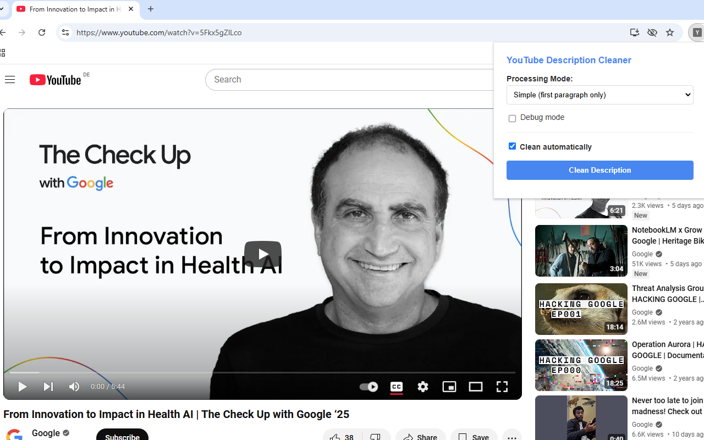
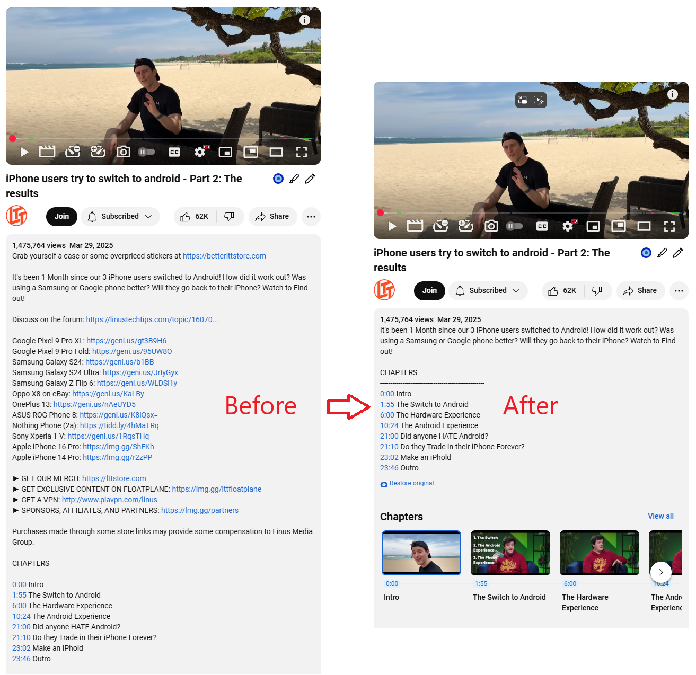

# YouTube Description Cleaner Extension
A browser extension that removes sponsorships and unrelated links from YouTube video descriptions with multiple AI backend support.

## Installation

### From Chrome Web Store

The extension is now available on the Chrome Web Store! [Install it here](https://chromewebstore.google.com/detail/youtube-description-rewri/bkifbmkpjodnagcldhlonpegnfolnlin).

### From sources

1. Download the extension files.
2. In a Chromium-based browser:
  - Go to `chrome://extensions/`.
    - Enable "Developer mode".
    - Click "Load unpacked".
    - Select the `/src/` folder.

## Configuration

Configure these options in the popup:

- **Processing Mode**: Select text processing method
- **API Key**: Required for cloud AI services
  - [Get your Gemini API key here](https://aistudio.google.com/app/apikey)
- **Mistral AI**: Configure Mistral backend
  - [Get started with Mistral AI here](https://docs.mistral.ai/getting-started/quickstart/)
- **Ollama Settings**: URL and model for local Ollama
  - [Learn how to install Ollama](https://ollama.ai)
- **Debug Mode**: Enable for troubleshooting
- **Auto Clean**: Process descriptions automatically

## Supported Backends

| Mode       | Requires API Key | Description                          |
|------------|------------------|--------------------------------------|
| Simple     | No               | Keeps first paragraph only           |
| Gemini     | Yes              | Google's AI (free tier available)    |
| Mistral AI | Yes              | French AI (free tier available)      |
| Ollama     | No               | Run local AI models                  |

## Troubleshooting

- Enable debug mode to see console logs
- For AI modes, ensure valid API keys
- Refresh page after changing settings

### Screenshots

#### Extension in Action

#### Before and After Comparison

## Version History

**0.0.2** - Apr 2, 2025
- Start using webpack
- New icons
- Updated README, add links to API keys
- Removed ChatGPT API option (no free tier)
- Added Mistral AI
- Improved prompt (much better for stupid models)

**0.0.1** - Initial release
- Basic description cleaning
- Multiple backend support
- Auto-clean functionality